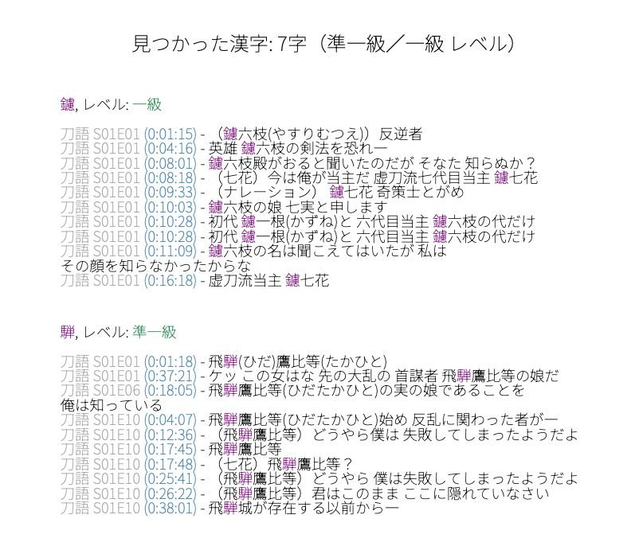

# 漢検字幕漢字抽出ツール (Kanken Subtitle Kanji Extractor)  


## 日本語  
このスクリプトは字幕ファイル(.srt/.ass)を分析して、漢検準一級・一級の漢字を自動で抽出してくれるツール！

### 主な機能
- 字幕から漢検対象の漢字を自動検出  
- 出現箇所のタイムスタンプと文脈を表示  
- Ankiデッキと連携して既習漢字をチェック  
- 進捗状況を分かりやすく可視化  
- PDF出力も可能（色付き！）  

### 使い方
1. AnkiConnectをインストールしてAnkiを起動  
2. コマンドラインで実行：  
```bash
python kanken_extractor.py [字幕ファイル/フォルダ] --deck "Ankiデッキ名" --word "単語フィールド名"
```  
3. オプション：  
   - `-e` → PDFで出力  
   - `-ia` → 音声なしのAnkiカードも対象に含める  

### 必要なもの
- Python 3.9+  
- `pysubs2`, `kanjize`, `reportlab` など（requirements.txt参照）  
- NotoSansJPフォント  

---

## English  
A Python script that analyses subtitle files (.srt/.ass) to extract kanji for Kanken j1k/1k levels that you don't already have in Anki!

### Key Features
- Extracts Kanken kanji from subtitles  
- Shows timestamps and context of each occurrence  
- Syncs with Anki decks to check known kanji  
- Visualises study progress  
- Colorful PDF export available  

### How to Use
1. Install AnkiConnect and launch Anki  
2. Run in terminal:  
```bash
python kanken_extractor.py [subtitle_file/folder] --deck "Anki Deck" --word "Word Field"
```  
3. Options:  
   - `-e` → Export as PDF  
   - `-ia` → Include Anki cards without audio  

### Requirements
- Python 3.9+  
- `pysubs2`, `kanjize`, `reportlab` etc. (see requirements.txt)  
- NotoSansJP font
